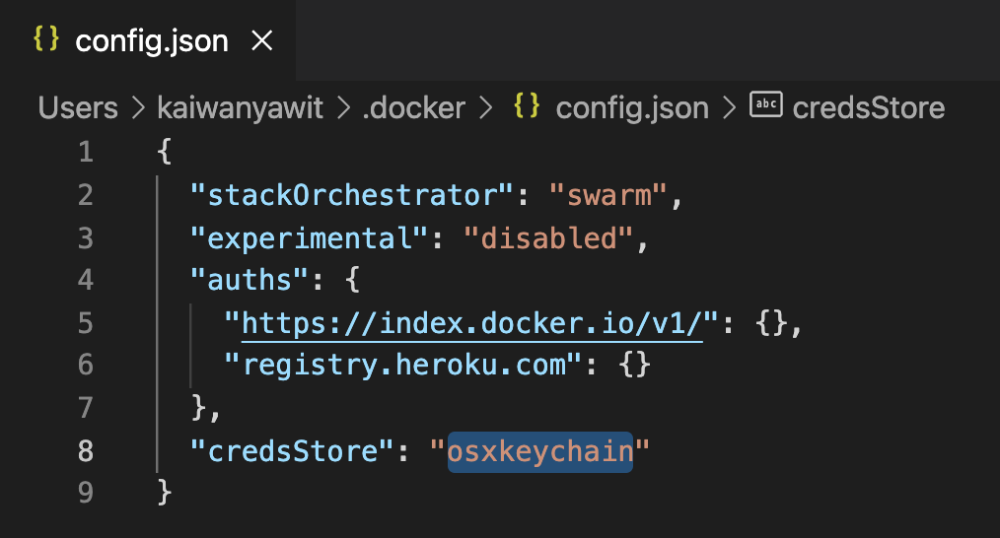

# Steps to use docker without Docker Desktop on Mac

## Enable docker command in terminal
You can use docker command in your terminal by following this instruction from [Dhwaneet Bhatt's blog](https://dhwaneetbhatt.com/blog/run-docker-without-docker-desktop-on-macos)

1. Install hyperkit and minikube
    ```text
    brew install hyperkit
    brew install minikube
    ```
    
1. Install Docker CLI
    ```text
    brew install docker
    brew install docker-compose
    ```
1. Start minikube
    ```text
    minikube start
    
    # Tell Docker CLI to talk to minikube's VM
    eval $(minikube docker-env)
    
    # Save IP to a hostname
    echo "`minikube ip` docker.local" | sudo tee -a /etc/hosts > /dev/null
    ```
1. Test
    ```text
    docker run hello-world
    ```
## Troubleshooting

  >## Fixing docker not found [credit](https://stackoverflow.com/questions/44084846/cannot-connect-to-the-docker-daemon-on-macos)
  >
  >    ```text
  >    brew install --cask docker
  >    ```

  >## Fixing docker docker-credential-desktop issue after DDoM removal [credit](https://github.com/docker/docker-credential-helpers/issues/149)
  >
  >1. Downloading the helpers
  >
  >    ```text
  >    brew install docker-credential-helper
  >    ```
  >
  >2. Open file ~/.docker/config.json and change "credsStore" : "desktop", to "credsStore" : "osxkeychain”.
  >
  >    


