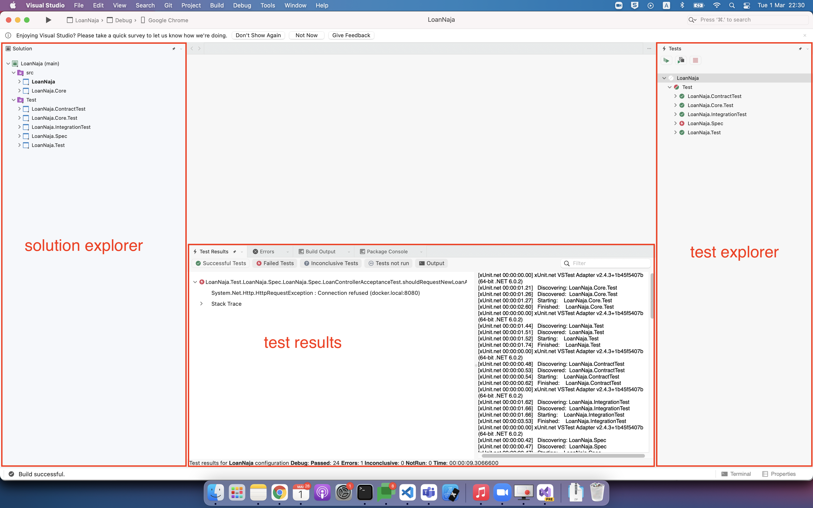
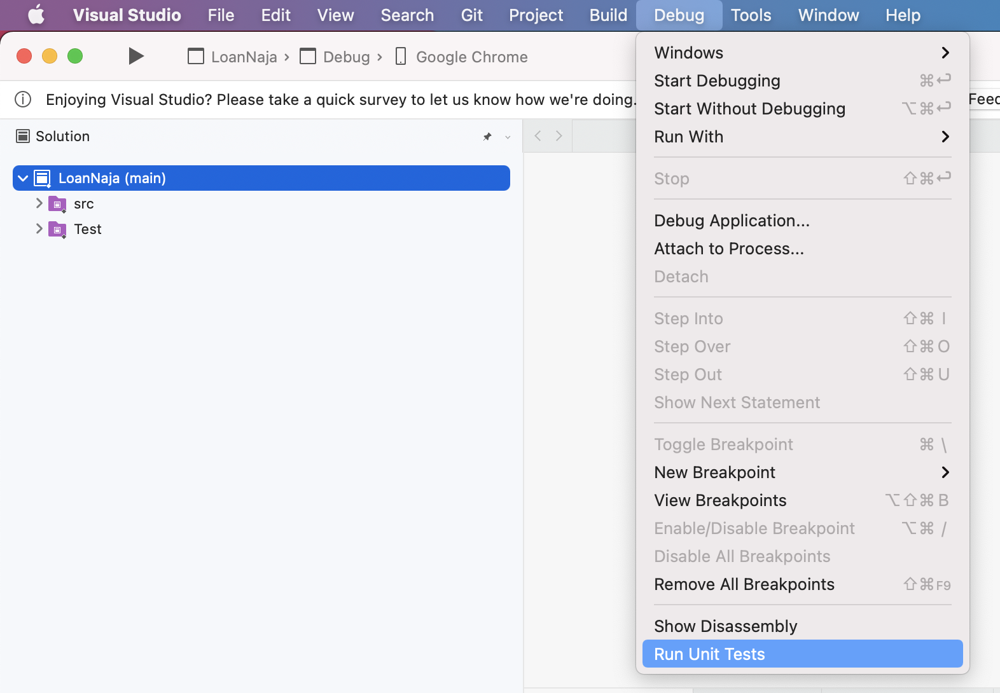
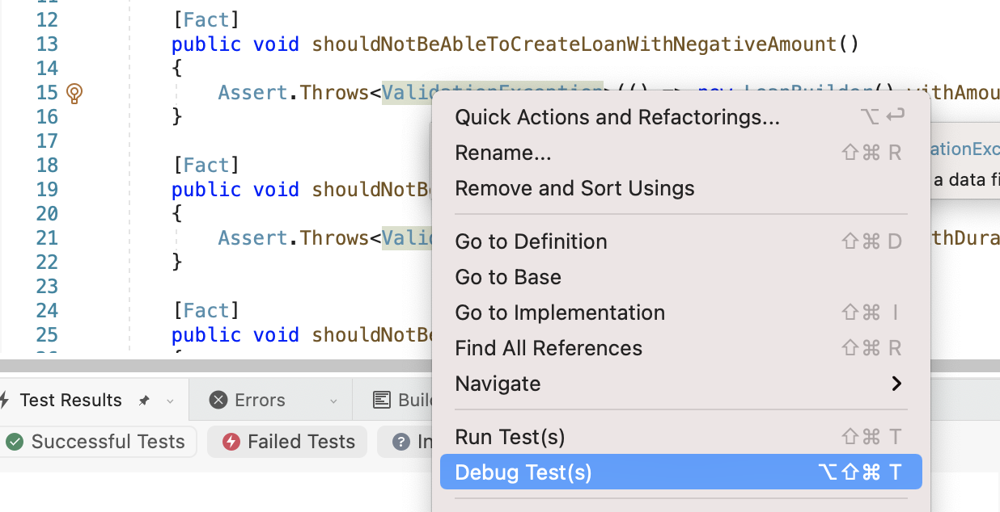
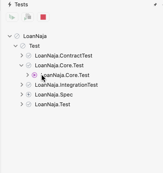

# Setup

## VS studio 2022

### UI

   1. This UI is a bit different from windows
   
   
   
   1. To run test click top menu Debug > Run Unit Tests
   
   

   1. We can debug each test by right click and click on Debug Test(s)
   
   

   1. We can rerun test by double click on the test name (it's a weird design)
   
   

