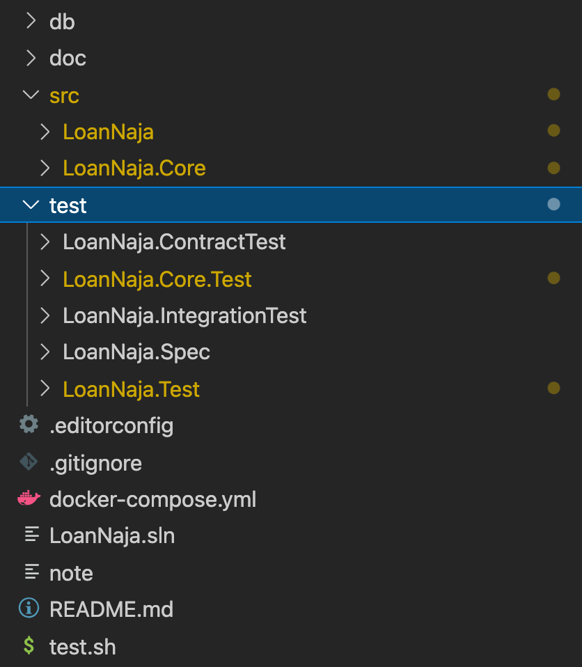
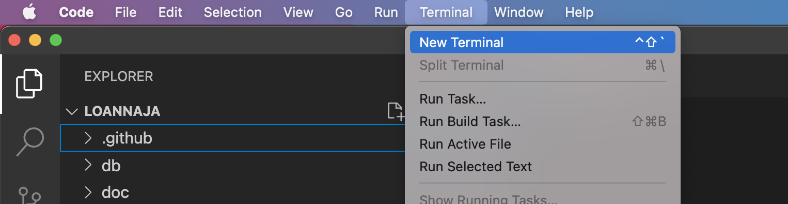
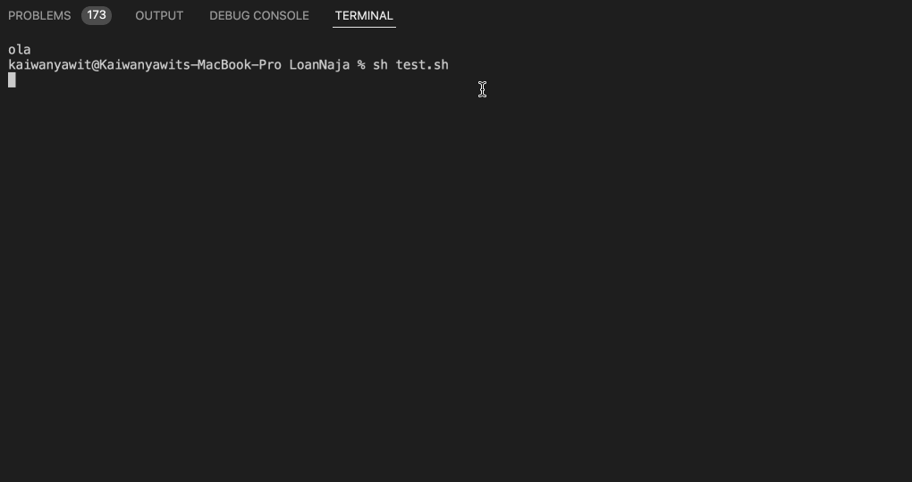
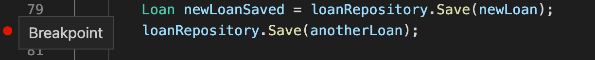
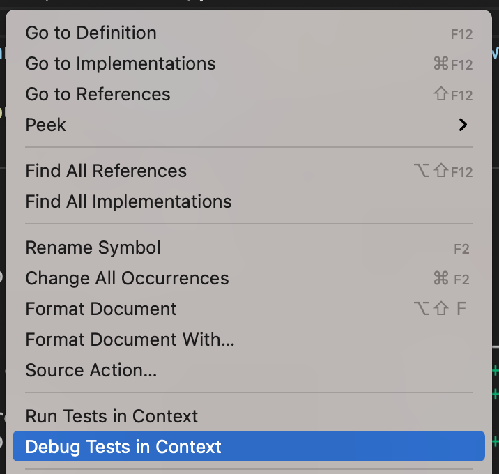
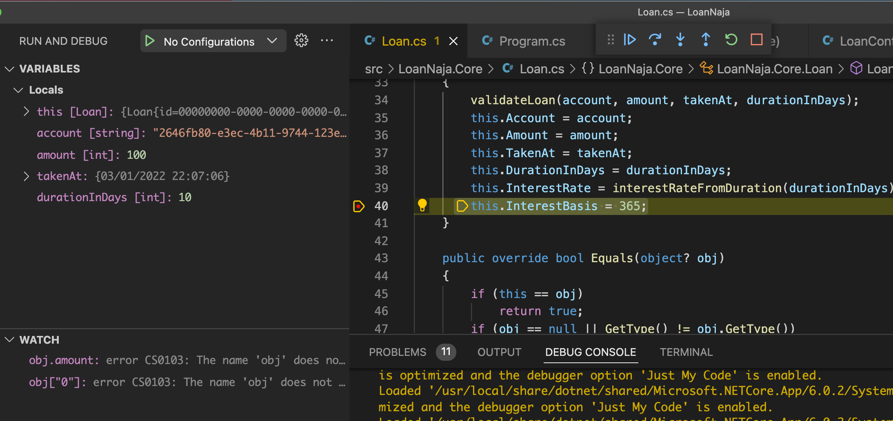
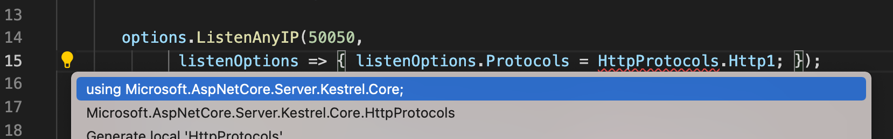

# Setup
## VSCode

### To run the solution
  1. Solution structure
  

  1. Open terminal by clicking on the top menu > Terminal > New Terminal
  

  1. Run tests by type `sh test.sh`
  

### Debug
  1. Toggle a breakpoint by clicking on the space before the line number.

  1. We can debug a test code by right click and click on menu `Debug Tests in Conext`

  1. With breakpoint, we can use debug and watch for checking object's value

### How to resolve dependencies in VSCode

  > Click on the lightblub (Control+.)
  

